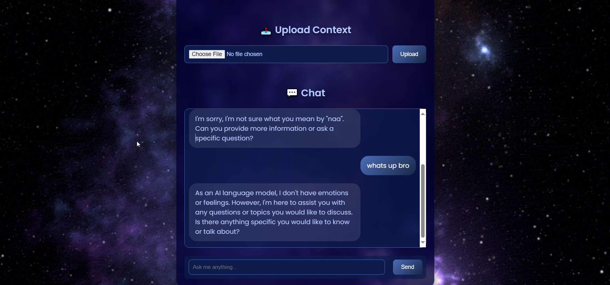

# Chatbot (Flask UI) 


This project demonstrates how to build a simple chatbot UI using Flask for the backend and HTML/CSS for the frontend. The chatbot uses **Azure OpenAI** to generate responses to your queries.




## Installation

1. **Clone the repository** 
2. **Create a virtual environment**:
   ```bash
   python -m venv .venv ```
Activate the virtual env:

On Windows:
```
.venv\Scripts\activate 
```
On macOS/Linux:
```
source .venv/bin/activate
```
Install the required dependencies plsss: 😏

```
pip install Flask langchain_openai openai python-dotenv # and whatever you're missing
```
Set up env variables: Create a .env file in the root of the project and add the following secret variables:

```
AZURE_OPENAI_API_KEY=your_azure_openai_api_key
AZURE_OPENAI_ENDPOINT=your_azure_openai_endpoint
```
    

## Running the application 🚀
Start the Flask server: In your terminal, run:

```
python app.py
```
Access the UI: Now open your browser and go to http://127.0.0.1:5000/. You should see the chatbot UI.

Talk with the chatbot: Enter a message and click "Send" to receive responses from the AI model. Now you have a virtual freidn created by me. 🗣️🤖 


## Functionalities

- You are able to interact with the chatbot in real-time.
- The chatbot allows you to upload a PDF file and ask questions regarding its content.